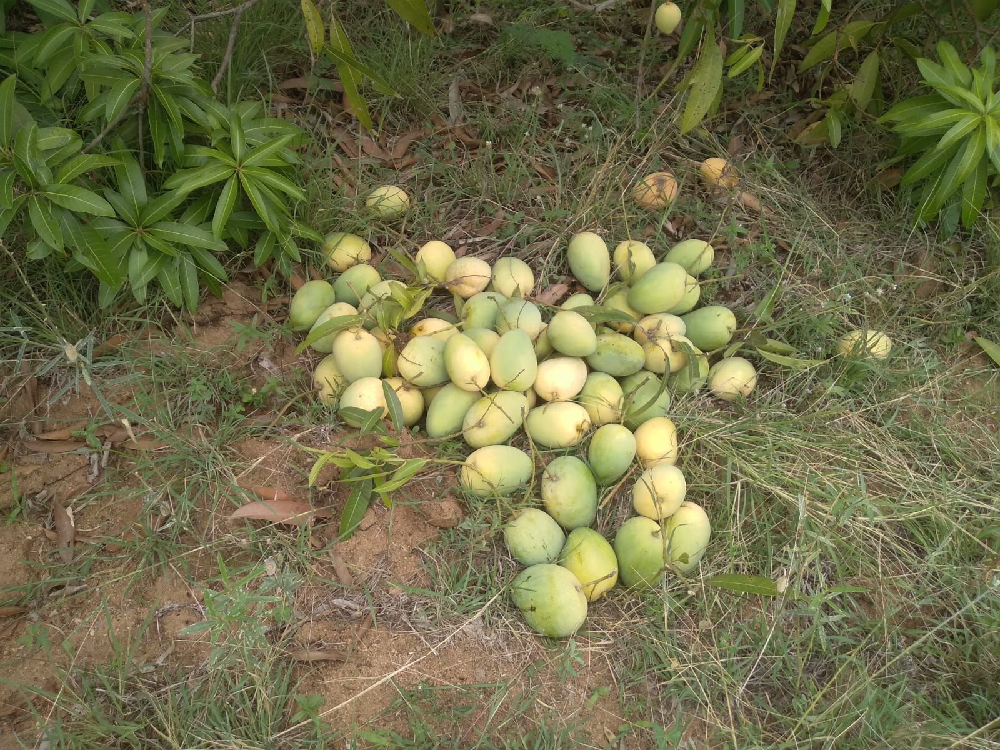
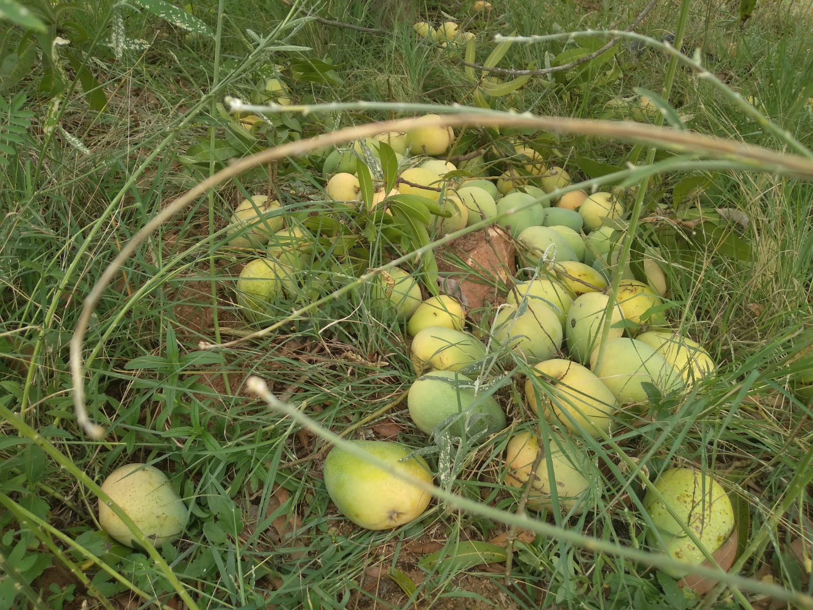
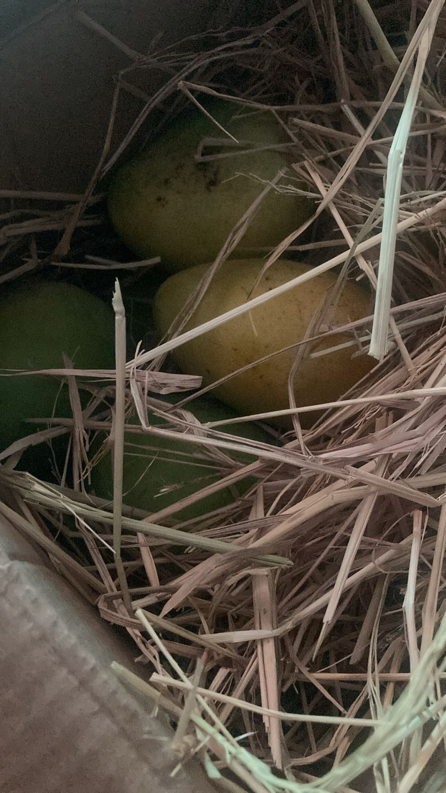

#+TITLE: Coopious - Copious Cooperation
#+AUTHOR: Thirumal Ravula
#+DATE: [2025-05-17 Fri]
#+SETUPFILE: ../org-templates/level-1.org
#+TAGS: boilerplate(b)
#+EXCLUDE_TAGS: boilerplate
#+OPTIONS: ^:nil

* Motivation
  
  It is a modest effort but a revolutionary one to connect
  the consumers directly to the farmers and their produce.
  This model would dissolve permanently some of the
  inveterate problems facing a consumer: access to quality
  produce; and facing a farmer: a remunerative price.  Also
  a myriad bunch of benefits would accrue both to the farmer
  and the consumer.

* Varieties and Prices

| S.No. | Variety      | Price / kg (Rs) | Weight of each box (kg) | Price of each box (Rs) |
|-------+--------------+-----------------+-------------------------+------------------------|
|    1. | Banginapalle |             150 |                       5 |                    750 |
|-------+--------------+-----------------+-------------------------+------------------------|
|    2. | Himayat      |             300 |                       5 |                   1500 |
|-------+--------------+-----------------+-------------------------+------------------------|

    
* Place your order
  Please fill the relevant form to place the order.

  - Default [[https://forms.gle/UjPvxr7vWibRtzRj6][form]].

  - IIIT Faculty, please fill this [[https://forms.gle/qRF7vQ31o5DUq9Be6][form]].

  - AP3 [[https://forms.gle/T3BQYS5H5Mk3if9S7][form]]

  

* Plan
  We will be harvesting as the fruit is ripening on the tree
  in batches of one tonne in the next few weeks. Each box is
  packed with hay inside to allow for further ripening.  The
  produce is totally organic. This farm never used chemical
  fertilizers. The land was fallow before we planted mango
  saplings.

* Benefits of buying from Coopious
  1. The mangoes are harvested only after they reach the
     ripening stage on the tree ensuring a sweet taste that
     eludes many that are procured from retail outlets in
     the city.

  2. Organically grown and naturally ripened.

  3. To be able to connect directly to the farmer and
     influence the way farming is carried out.  However
     radical the idea is, this could have profound
     implications in mitigating many of the bad practices in
     farming leading to healthy soil, nutritious and tasty
     produce and healthy consumers.  On the whole a road
     towards sustainable farming could be paved.

* Pictures
  

  

  
